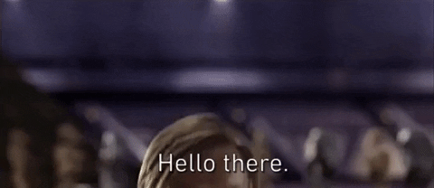

# Hello There 

I am a fourth year computer science student at Epitech. Linux, FOSS, Homelabbing and tinkering with my system is what I spend my time on.

I focus on writing tools in Rust and contributing to [OpenStreetMap](https://www.openstreetmap.org/).

> [!NOTE]
> I am on the lookout for an end of studies internship. Please reach out to me via [mail](mailto:d99tbwy91@mozmail.com) if you are interested.

Some projects I worked on are:

- [A rofi plugin for Obsidian vault opening](https://github.com/Nydragon/rofi-obsidian)
- [A virtual arcade machine with switching of graphical backend at runtime](https://github.com/Nydragon/Arcade)
- [A basic Scheme Interpeter](https://github.com/Nydragon/GLaDOS-2023)
- [An R-Type like multiplayer sidescroller](https://github.com/Epitech-R-Type/R-Type)

